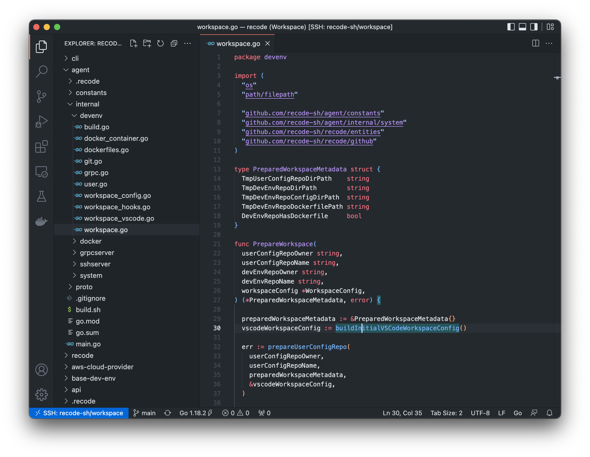

<p align="center">
  
</p>

<p align="center">
    <h1 align="center">Recode</h1>
    <p align="center">Remote development environments defined as code. Running on your cloud provider account.<br/> Currently available on <a href="https://github.com/recode-sh/aws-cloud-provider">Amazon Web Services</a> and Visual Studio Code.</p>
</p>

```bash
recode aws start recode-sh/workspace --instance-type t2.medium
```

<blockquote align="right">
  ... see the <a href="https://github.com/recode-sh/workspace">recode-sh/workspace</a> repository for an example of development environment configuration
</blockquote>



## Table of contents
- [Requirements](#requirements)
- [Installation](#installation)
- [Usage](#usage)
    - [Login](#login)
    - [Start](#start)
    - [Stop](#stop)
    - [Remove](#remove)
    - [Uninstall](#uninstall)
- [Development environments configuration](#development-environments-configuration)
    - [Tip: the --rebuild flag](#-tip-the---rebuild-flag)
    - [Tip: Docker & Docker compose](#-tip-docker--docker-compose)
    - [User configuration](#user-configuration)
    - [Project configuration](#project-configuration)
        - [What if I don't have an user configuration?](#-what-if-i-dont-have-an-user-configuration)
    - [Recode configuration](#recode-configuration)
        - [Base image (recode-sh/base-dev-env)](#base-image-recode-shbase-dev-env)
        - [Visual Studio Code extensions](#visual-studio-code-extensions)
        - [Multiple repositories](#multiple-repositories)
        - [Build arguments (RECODE_INSTANCE_OS and RECODE_INSTANCE_ARCH)](#build-arguments-recode_instance_os-and-recode_instance_arch)
        - [Hooks](#hooks)
- [Frequently asked questions](#frequently-asked-questions)
    - [How does it compare with GitPod/Coder/Codespaces/X?](#how-does-it-compare-with-gitpodcodercodespacesx)
    - [How does it compare with VSCode remote SSH / Container extensions?](#how-does-it-compare-with-vscode-remote-ssh--container-extensions)
- [The future](#the-future)
- [License](#license)

## Requirements

The Recode binary has been tested on Linux and Mac. Support for Windows is theoretical ([testers needed](https://github.com/recode-sh/cli/issues/4) 💙).

Before using Recode, the following dependencies need to be installed:

- [Visual Studio Code](https://code.visualstudio.com/) (currently the sole editor supported).

- [OpenSSH Client](https://www.openssh.com/) (used to access your development environments).

## Installation

The easiest way to install Recode is by running the following command in your terminal:

```bash
curl -sf https://raw.githubusercontent.com/recode-sh/cli/main/install.sh | sh -s -- -b /usr/local/bin latest
```

You could change:

  - The default installation directory by replacing `/usr/local/bin` with your prefered path.
  
  - The version installed by replacing `latest` with a [specific version](https://github.com/recode-sh/cli/releases).

Confirm that Recode is installed by running the `recode` command:

```bash
recode --help
```

## Usage

```console
To begin, run the command "recode login" to connect your GitHub account.	

From there, the most common workflow is:

  - recode <cloud_provider> start <repository>  : to start a development environment for a specific GitHub repository
  - recode <cloud_provider> stop <repository>   : to stop a development environment (without removing your data)
  - recode <cloud_provider> remove <repository> : to remove a development environment AND your data
  
<repository> may be relative to your personal GitHub account (eg: cli) or fully qualified (eg: my-organization/api).

Usage:
  recode [command]

Available Commands:
  aws         Use Recode on Amazon Web Services
  completion  Generate the autocompletion script for the specified shell
  help        Help about any command
  login       Connect a GitHub account to use with Recode

Flags:
  -h, --help   help for recode

Use "recode [command] --help" for more information about a command.
```

### Login

```bash
recode login
```
To begin, you need to run the `login` command to connect your GitHub account.

Recode requires the following permissions:

  - "*Public SSH keys*" and "*Repositories*" to let you access your repositories from your development environments.
	
  - "*GPG Keys*" and "*Personal user data*" to configure Git and sign your commits (verified badge).

**All your data (including the OAuth access token) are only stored locally in `~/.config/recode/recode.yml` (or in `XDG_CONFIG_HOME` if set).**

The source code that implements the GitHub OAuth flow is located in the [recode-sh/api](https://github.com/recode-sh/api) repository.

### Start

```bash
recode <cloud_provider> start <repository>
```
The `start` command creates and starts a development environment for a specific GitHub repository.

If a development environment is stopped, it will only be started. If a development environment is already started, only your code editor will be opened.

An `--instance-type` flag could be passed to specify the instance type that will power your development environment. (*See the corresponding cloud provider repository for default / valid values*).

#### Examples

```bash
recode aws start recode-sh/workspace
```

```bash
recode aws start recode-sh/workspace --instance-type t2.medium
```

### Stop

```bash
recode <cloud_provider> stop <repository>
```
The `stop` command stops a started development environment.

Stopping means that the underlying instance will be stopped but **<ins>your data will be conserved</ins>**. You may want to use this command to save costs when the development environment is not used.

#### Example

```bash
recode aws stop recode-sh/workspace
```

### Remove

```bash
recode <cloud_provider> remove <repository>
```

The `remove` command removes an existing development environment.

Removing means that the underlying instance **<ins>and all your data</ins>** will be **<ins>permanently removed</ins>**.

#### Example

```bash
recode aws remove recode-sh/workspace
```

### Uninstall

```bash
recode <cloud_provider> uninstall
```

The `uninstall` command removes all the infrastructure components used by Recode from your cloud provider account. (*See the corresponding cloud provider repository for details*).

**Before running this command, all development environments need to be removed.**

#### Example

```bash
recode aws uninstall
```

## Development environments configuration

If you think about all the projects you've worked on, you may notice that you've:

  - a set of configuration / tools used for all your projects (eg: a prefered timezone / locale, a specific shell...);
  
  - a set of configuration / tools specific for each project (eg: docker compose, go >= 1.18 or node.js >= 14).

This is what Recode has tried to mimic with *user* and *project* configuration.

#### 💡 Tip: the `--rebuild` flag

```bash
recode aws start recode-sh/workspace --rebuild
```

If you update the configuration of an existing development environment, you could use the `--rebuild` flag of the `start` command to rebuild it without having to delete it first.

#### 💡 Tip: Docker & Docker compose

Docker and Docker compose are already preinstalled in all development environments so you don't have to install them.

### User configuration

User configuration corresponds to the set of configuration / tools used for all your projects. To create an user configuration, all you need to do is to:

  1. Create a <ins>**repository**</ins> named `.recode` in your personal GitHub account.
  
  2. Add a file named `dev_env.Dockerfile` in it.

The file `dev_env.Dockerfile` is a regular Dockerfile except that: 

  - it must derive from `recode-sh/base-dev-env` (more below);
  
  - the user configuration needs to be applied to the user `recode`.

Otherwise, you are free to do what you want with this file and this repository. You could see an example with dotfiles in [recode-sh/.recode](https://github.com/recode-sh/.recode) and use it as a GitHub repository template: 

```Dockerfile
# User's dev env image must derive from recodesh/base-dev-env.
# See https://github.com/recode-sh/base-dev-env/blob/main/Dockerfile for source.
FROM recodesh/base-dev-env:latest

# Set timezone
ENV TZ=America/Los_Angeles

# Set locale
RUN sudo locale-gen en_US.UTF-8
ENV LANG=en_US.UTF-8
ENV LANGUAGE=en_US:en 
ENV LC_ALL=en_US.UTF-8

# Install Zsh
RUN set -euo pipefail \
  && sudo apt-get --assume-yes --quiet --quiet update \
  && sudo apt-get --assume-yes --quiet --quiet install zsh \
  && sudo rm --recursive --force /var/lib/apt/lists/*

# Install OhMyZSH and some plugins
RUN set -euo pipefail \
  && sh -c "$(curl --fail --silent --show-error --location https://raw.githubusercontent.com/ohmyzsh/ohmyzsh/master/tools/install.sh)" \
  && git clone --quiet https://github.com/zsh-users/zsh-autosuggestions ${ZSH_CUSTOM:-~/.oh-my-zsh/custom}/plugins/zsh-autosuggestions \
  && git clone --quiet https://github.com/zsh-users/zsh-syntax-highlighting.git ${ZSH_CUSTOM:-~/.oh-my-zsh/custom}/plugins/zsh-syntax-highlighting

# Change default shell for user "recode"
RUN set -euo pipefail \
  && sudo usermod --shell $(which zsh) recode

# Add all dotfiles to home folder
COPY --chown=recode:recode ./dotfiles/.* $HOME/
```

### Project configuration

Project configuration corresponds to the set of configuration / tools specific for each project. As you may have guessed, to create a project configuration, all you need to do is to:

  1. Create a <ins>**directory**</ins> named `.recode` in your project's repository.
  
  2. Add a file named `dev_env.Dockerfile` in it.

The file `dev_env.Dockerfile` is a regular Dockerfile except that: 

  - it must derive from `user_dev_env` (your user configuration);
  
  - the user configuration needs to be applied to the user `recode`.

Otherwise, you are free to do what you want with this file and this directory. You could see an example in [recode-sh/workspace](https://github.com/recode-sh/workspace):

```Dockerfile
# Project's dev env image must derive from "user_dev_env"
# (ie: github_user_name/.recode/dev_env.Dockerfile)
FROM user_dev_env

# VSCode extensions that need to be installed (optional)
LABEL sh.recode.vscode.extensions="golang.go, zxh404.vscode-proto3, ms-azuretools.vscode-docker"

# GitHub repositories that need to be cloned (optional) (default to the current one)
LABEL sh.recode.repositories="cli, agent, recode, aws-cloud-provider, base-dev-env, api, .recode, workspace"

# Reserved args (RECODE_*). Provided by Recode.
# eg: linux
ARG RECODE_INSTANCE_OS
# eg: amd64 or arm64
ARG RECODE_INSTANCE_ARCH

ARG GO_VERSION=1.18.2

# Install Go and dev dependencies
RUN set -euo pipefail \
  && cd /tmp \
  && LATEST_GO_VERSION=$(curl --fail --silent --show-error --location "https://golang.org/VERSION?m=text") \
  && if [[ "${GO_VERSION}" = "latest" ]] ; then \
        GO_VERSION_TO_USE="${LATEST_GO_VERSION}" ; \
     else \
        GO_VERSION_TO_USE="go${GO_VERSION}" ; \
     fi \
  && curl --fail --silent --show-error --location "https://go.dev/dl/${GO_VERSION_TO_USE}.${RECODE_INSTANCE_OS}-${RECODE_INSTANCE_ARCH}.tar.gz" --output go.tar.gz \
  && sudo tar --directory /usr/local --extract --file go.tar.gz \
  && rm go.tar.gz \
  && /usr/local/go/bin/go install golang.org/x/tools/cmd/goimports@latest \
  && /usr/local/go/bin/go install github.com/google/wire/cmd/wire@latest \
  && /usr/local/go/bin/go install github.com/golang/mock/mockgen@latest

# Add Go to path
ENV PATH=$PATH:/usr/local/go/bin:$HOME/go/bin

...
```
#### 💡 What if I don't have an user configuration?

If you don't have an user configuration, **the [recode-sh/.recode](https://github.com/recode-sh/.recode) repository will be used as a default one**.

That's why you will have `zsh` configured as default shell in your project.

### Recode configuration

As you may have noticed from previous sections, some commands in the `dev_env.Dockerfile` files (like the `LABEL` ones) are specific to Recode. This section will try to explain them.

#### Base image ([recode-sh/base-dev-env](http://github.com/recode-sh/base-dev-env))

As you may have understood, all the development environments derive directly or indirectly from `recode-sh/base-dev-env`. You could see the source of this Docker image in the [recode-sh/base-dev-env](https://github.com/recode-sh/base-dev-env) repository:

```Dockerfile
# All development environments will be Ubuntu-based
FROM ubuntu:22.04

ARG DEBIAN_FRONTEND=noninteractive

# RUN will use bash
SHELL ["/bin/bash", "-c"]

# Install system dependencies
RUN set -euo pipefail \
  && apt-get --assume-yes --quiet --quiet update \
  && apt-get --assume-yes --quiet --quiet install \
  apt-transport-https \
  build-essential \
  ca-certificates \
  curl \
  git \
  gnupg \
  locales \
  lsb-release \
  nano \
  sudo \
  tzdata \
  unzip \
  vim \
  wget \
  && rm --recursive --force /var/lib/apt/lists/*

# Install the Docker CLI. 
# The Docker daemon socket will be mounted from instance.
RUN set -euo pipefail \
  && curl --fail --silent --show-error --location https://download.docker.com/linux/ubuntu/gpg | gpg --dearmor --output /usr/share/keyrings/docker-archive-keyring.gpg \
  && echo "deb [arch=$(dpkg --print-architecture) signed-by=/usr/share/keyrings/docker-archive-keyring.gpg] https://download.docker.com/linux/ubuntu $(lsb_release --codename --short) stable" | tee /etc/apt/sources.list.d/docker.list > /dev/null \
  && apt-get --assume-yes --quiet --quiet update \
  && apt-get --assume-yes --quiet --quiet install docker-ce-cli \
  && rm --recursive --force /var/lib/apt/lists/*

# Install Docker compose
RUN set -euo pipefail \
  && LATEST_COMPOSE_VERSION=$(curl --fail --silent --show-error --location "https://api.github.com/repos/docker/compose/releases/latest" | grep --only-matching --perl-regexp '(?<="tag_name": ").+(?=")') \
  && curl --fail --silent --show-error --location "https://github.com/docker/compose/releases/download/${LATEST_COMPOSE_VERSION}/docker-compose-$(uname --kernel-name)-$(uname --machine)" --output /usr/libexec/docker/cli-plugins/docker-compose \
  && chmod +x /usr/libexec/docker/cli-plugins/docker-compose

# Install entrypoint script
COPY ./recode_entrypoint.sh /
RUN chmod +x /recode_entrypoint.sh

# Configure the user "recode" in container.
# Triggered during build on instance.
# 
# We want the user "recode" inside the container to get 
# the same permissions than the user "recode" in the instance 
# (to access the Docker daemon, SSH keys and so on).
# 
# To do this, the two users need to share the same UID/GID.
ONBUILD ARG RECODE_USER_ID
ONBUILD ARG RECODE_USER_GROUP_ID
ONBUILD ARG RECODE_DOCKER_GROUP_ID

ONBUILD RUN set -euo pipefail \
  && RECODE_USER_HOME_DIR="/home/recode" \
  && RECODE_USER_WORKSPACE_DIR="${RECODE_USER_HOME_DIR}/workspace" \
  && RECODE_USER_WORKSPACE_CONFIG_DIR="${RECODE_USER_HOME_DIR}/.workspace-config" \
  && groupadd --gid "${RECODE_USER_GROUP_ID}" --non-unique recode \
  && useradd --gid "${RECODE_USER_GROUP_ID}" --uid "${RECODE_USER_ID}" --non-unique --home "${RECODE_USER_HOME_DIR}" --create-home --shell /bin/bash recode \
  && cp /etc/sudoers /etc/sudoers.orig \
  && echo "recode ALL=(ALL) NOPASSWD:ALL" | tee /etc/sudoers.d/recode > /dev/null \
  && groupadd --gid "${RECODE_DOCKER_GROUP_ID}" --non-unique docker \
  && usermod --append --groups docker recode \
  && mkdir --parents "${RECODE_USER_WORKSPACE_CONFIG_DIR}" \
  && mkdir --parents "${RECODE_USER_WORKSPACE_DIR}" \
  && mkdir --parents "${RECODE_USER_HOME_DIR}/.ssh" \
  && mkdir --parents "${RECODE_USER_HOME_DIR}/.gnupg" \
  && mkdir --parents "${RECODE_USER_HOME_DIR}/.vscode-server" \
  && chown --recursive recode:recode "${RECODE_USER_HOME_DIR}" \
  && chmod 700 "${RECODE_USER_HOME_DIR}/.gnupg"

ONBUILD WORKDIR /home/recode/workspace
ONBUILD USER recode

ONBUILD ENV USER=recode
ONBUILD ENV HOME=/home/recode
ONBUILD ENV EDITOR=/usr/bin/nano

ONBUILD ENV RECODE_WORKSPACE=/home/recode/workspace
ONBUILD ENV RECODE_WORKSPACE_CONFIG=/home/recode/.workspace-config

# Only for documentation purpose.
# Entrypoint and CMD are always set by the 
# Recode agent when running the dev env container.
ONBUILD ENTRYPOINT ["/recode_entrypoint.sh"]
ONBUILD CMD ["sleep", "infinity"]

# Set default timezone
ENV TZ=America/Los_Angeles

# Set default locale
# /!\ locale-gen must be run as root
RUN locale-gen en_US.UTF-8
ENV LANG=en_US.UTF-8
ENV LANGUAGE=en_US:en
ENV LC_ALL=en_US.UTF-8
```

As you can see, nothing fancy here. 

Recode is built on `ubuntu` with `docker` and `docker compose` pre-installed. An user `recode` is created and configured to be used as the default user. Root privileges are managed via `sudo`.

Your repositories will be cloned in `/home/recode/workspace`. A default timezone and locale are set.

*(To learn more, see the [recode-sh/base-dev-env](https://github.com/recode-sh/base-dev-env) repository)*.

#### Visual Studio Code extensions

In order to require Visual Studio Code extensions to be installed in your development environment, you need to add a `LABEL` named `sh.recode.vscode.extensions` in your *user's* or *project's* `dev_env.Dockerfile`.

*(As you may have guessed, if this label is added to your user configuration, all your projects will have the listed extensions installed).*

An extension is identified using its publisher name and extension identifier (`publisher.extension`). You can see the name on the extension's detail page.

##### Example

```Dockerfile
LABEL sh.recode.vscode.extensions="golang.go, zxh404.vscode-proto3, ms-azuretools.vscode-docker"
```

#### Multiple repositories

If you want to use multiple repositories in your development environment, you need to add a `LABEL` named `sh.recode.repositories` in your *project's* `dev_env.Dockerfile`.

**In this case, we recommend you to create an empty repository that will only contain the `.recode` directory (as an example, see the [recode-sh/workspace](https://github.com/recode-sh/workspace) repository).**

*(As you may have guessed, if this label is added to your user configuration it will be ignored).*

Repositories may be set as relative to the current one (eg: `cli`) or fully qualified (eg: `recode-sh/cli`).

##### Example

```Dockerfile
LABEL sh.recode.repositories="cli, agent, recode, aws-cloud-provider, base-dev-env, api, .recode, workspace"
```

#### Build arguments (`RECODE_INSTANCE_OS` and `RECODE_INSTANCE_ARCH`)

Given the nature of this project, you need to take into account the fact that the characteristics of the instance used to run your development environment may vary depending on the one chosen by the final user.

As an example, an user may want to use an AWS graviton powered instance to run your project and, as a result, your *project's* `dev_env.Dockerfile` must be ready to be built for `ARM`.

To ease this process, Recode will pass to your `dev_env.Dockerfile` files two build arguments `RECODE_INSTANCE_OS` and `RECODE_INSTANCE_ARCH` that will contain both the current operating system (`linux`) and architecture (eg: `amd64`) respectively.

##### Example

```Dockerfile
# Reserved args (RECODE_*). Provided by Recode.

# eg: linux
ARG RECODE_INSTANCE_OS

# eg: amd64 or arm64
ARG RECODE_INSTANCE_ARCH
```

#### Hooks

Hooks are shell scripts that will be run during the lifetime of your development environment. To be able to add a hook in a project, all you have to do is to add a directory named `hooks` in your `.recode` **directory**.

##### First Hook

Before adding your first hook, the following things must be taken into account:

 - In the case of development environments **with only one repository**, hooks will only be run if a `dev_env.Dockerfile` file is set.
 
 - In the case of development environments **with multiple repositories**, all the hooks will be run, one after the other.
 
 - **The working directory of your scripts will be set to the root folder of their respective repository before running**.

##### Init

The `init` hook is run once, **during the first start of your development environment**. You could use it to download your project dependencies, for example.

Currently, it's the sole hook available. To activate it, you need to add an `init.sh` file in your project's `hooks` directory.

##### Example (taken from the [recode-sh/cli](https://github.com/recode-sh/cli/tree/main/.recode) repository)

```bash
#!/bin/bash
set -euo pipefail

log () {
  echo -e "${1}" >&2
}

log "Downloading dependencies listed in go.mod"

go mod download
```

## Frequently asked questions

#### How does it compare with GitPod/Coder/Codespaces/X?

- 100% Free.
- 100% Open-source.
- 100% Private (run on your own cloud provider account).
- 100% Cost-effective (run on simple VMs not on Kubernetes).
- 100% Desktop.
- 100% Multi regions.
- 100% Customizable (from VM characteristics to installed runtimes).
- 100% Community-driven (see below).

... and 0% VC-backed. 0% Locked-in. 0% Proprietary config files.

#### How does it compare with VSCode remote SSH / Container extensions?

- Remote development environments defined as code (with support for user and project configuration).
- Automatic infrastructure / VM provisionning for multiple cloud providers.
- Fully integrated with GitHub (private and multiple repositories, verified commits...).
- Support the pre-installation of VSCode extensions.
- Doesn't require Docker to be installed locally.
- Doesn't tied to a specific code editor.

## The future

This project is **100% community-driven**, meaning that except for bug fixes <ins>**no more features will be added**</ins>. 

The only features that will be added are the ones that will be [posted as an issue](https://github.com/recode-sh/cli/issues/new) and that will receive a significant amount of upvotes **(>= 10 currently)**.

## License

Recode is available as open source under the terms of the [MIT License](http://opensource.org/licenses/MIT).
